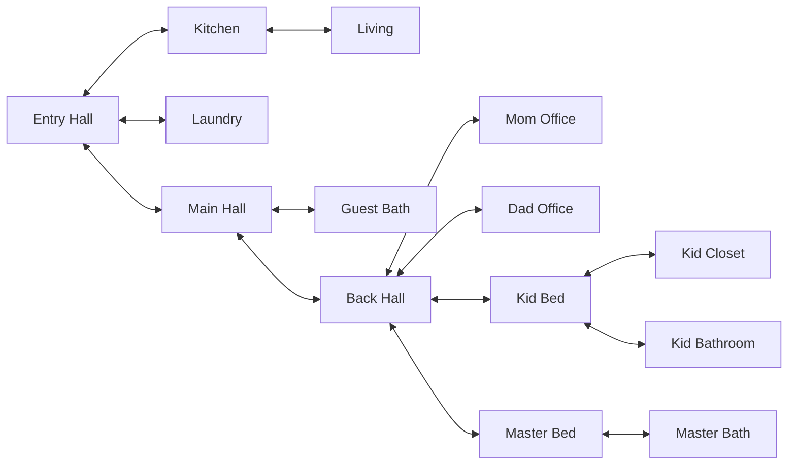

# PAR Treasure Hunt

## Description
Create a treasure hunt by generating a list of places that must be followed in order with the treasure at the end.  
You create a list of rooms and places within those rooms and optionally a diagram describing how the rooms are connected so distance between locations can be computed.  
Distance is optionally used to maximize the amount of running around needed to complete the hunt.  
The program will output a list of locations that should be printed and cut into strips. You then hide the strips in the locations stated on the paper.  
The participants start with strip #1 and go to the destination on the strip which will contain the next strip and location.  

One rule that should be followed is: You may come across notes that are not the current next place in the search.
It is important that they not look at notes they may see on their way to their next destination.
The numbering of the notes helps ensure the one they find is the next one in the chain. Not following the chain can result in a broken hunt!


Print using a monospaced font to make it easier to cut out the paper strips.

The output is a list of locations you print out and cut into strips. Each strip contains the step number in the hunt, where the strip needs to be placed and the next place to go when the strip is found.

Example strip: Step #7 in the hunt, needs to be placed in / on the Sink in the Laundry room. When the child finds the note the need to go to "Master Bath" room and look in / near the "Bathtub"
```text
*** Laundry ***
   #7 Sink                 * Master Bath - Bathtub
```

The last strip of paper before the treasure will show "!! X !!" that tells the child the treasure is the next step!
Example finals strip: Step #30 in the hunt, needs to be placed on / under the keyboard in "Mom Office", Next location is "Mom Office" on "Mom chair" and will contain the treasure. 
```text
*** Mom Office ***
   #30 Mom keyboard        * Mom Office - Mom chair !! X !!
```

The list of strips on the printed paper is grouped by room to make it easier to place all the notes.

You can specify the starting and ending locations if you dont want them randomized.


## Technology
- Python 3.11+

## Prerequisites
- Python 3.11 or higher
- uv package manager

## Installation
```shell
uv tool install par_treasure_hunt
```

## Update
```shell
uv tool install par_treasure_hunt -U --force
```

## Installed Usage
```shell
par_treasure_hunt [OPTIONS]
```

## From source Usage
```shell
uv run par_treasure_hunt [OPTIONS]
```

### CLI Options
- `-n`, `--num-places INTEGER`: Number of places to use [default: 150]
- `-r`, `--randomness FLOAT`: Randomness factor (0.0-1.0) [default: 0.3]
- `-l`, `--locations-file TEXT`: Path to JSON file with location data
- `-m`, `--mermaid-graph TEXT`: Path to Mermaid graph file to compute distances from
- `-fr`, `--first-room TEXT`: Room name for the starting location
- `-fp`, `--first-place TEXT`: Place name for the starting location
- `-lr`, `--last-room TEXT`: Room name for the final treasure location
- `-lp`, `--last-place TEXT`: Place name for the final treasure location
- `--debug`: Enable debug mode
- `-v`, `--version`: Print version information and exit
- `-h`, `--help`: Show this help message and exit

## Example Usage
```shell
# Generate a hunt with 10 places
uv run par_treasure_hunt --num-places=10

# Generate a hunt with high randomness
uv run par_treasure_hunt --randomness=0.8

# Specify the starting location
uv run par_treasure_hunt --first-room="Kids Bed" --first-place="Bed"

# Specify the final treasure location
uv run par_treasure_hunt --last-room="Kitchen" --last-place="Fruit basket"

# Specify both start and end locations
uv run par_treasure_hunt --first-room="Child Bed" --first-place="Bed" --last-room="Kitchen" --last-place="Fruit basket"

# Use custom locations file
uv run par_treasure_hunt --locations-file="/path/to/my_locations.json"

# Use Mermaid graph file to compute distances dynamically in order to maximize running around
uv run par_treasure_hunt --mermaid-graph="/path/to/my_graph.mermaid"

# Combine custom locations with Mermaid graph
uv run par_treasure_hunt --locations-file="/path/to/my_locations.json" --mermaid-graph="/path/to/my_graph.mermaid"

# Show debug information during generation
uv run par_treasure_hunt --debug
```

## How It Works
By default, the hunt uses a randomly selected starting location and selects each subsequent location to maximize the distance from the previous location using a room distance matrix. The randomness parameter (0.0-1.0) introduces variability to make each hunt unique:

- Lower randomness (0.0-0.3): More predictable, follows distance optimization more strictly
- Medium randomness (0.3-0.6): Balanced approach with some unpredictability
- Higher randomness (0.6-1.0): More chaotic routing with less distance optimization

### Locations
Locations are defined using a json file that specifies the room name and the locations where notes can be hidden in that room
```json
[
  {
    "room_name": "Dad Office",
    "places": [
      "Dad chair",
      "Bookshelf"
    ]
  },
  {
    "room_name": "Mom Office",
    "places": [
      "Mom chair",
      "Mom keyboard"
    ]
  },
  {
    "room_name": "Kids Bed",
    "places": [
      "Yarn cubby",
      "Bookshelf"
    ]
  },
  {
    "room_name": "Kids Closet",
    "places": [
      "On dresser",
      "Toy box"
    ]
  },
  {
    "room_name": "Kids Bathroom",
    "places": [
      "Toothpaste drawer",
      "Bathtub"
    ]
  },
  {
    "room_name": "Master Bed",
    "places": [
      "On dad nightstand",
      "On mom nightstand"
    ]
  },
  {
    "room_name": "Master Bath",
    "places": [
      "Dad sink counter",
      "Mom sink counter"
    ]
  },
  {
    "room_name": "Kitchen",
    "places": [
      "Counter",
      "Fruit basket"
    ]
  },
  {
    "room_name": "Living",
    "places": [
      "End table drawer",
      "TV stand"
    ]
  },
  {
    "room_name": "Laundry",
    "places": [
      "Under Dryer",
      "Sink"
    ]
  }
]

```

### Distance Matrix
The distance matrix is used to determine how far apart rooms are. It can be:
1. Computed from a Mermaid graph file (specified via --mermaid-graph)
2. Automatically computed from locations_graph.mermaid if it exists
3. Fallback to random selection if no graph file is available

The Mermaid graph format allows defining room connections as a graph. The application uses the label portion of each node (the text inside the square brackets) for room names:


Each connection has a distance of 1, and distances between non-connected rooms are computed as the shortest path through the graph.

## Example Output
```text
*** Kids Bathroom ***
   #20 Bathtub             * Master Bed - On mom nightstand
   #27 Toothpaste drawer   * Dad Office - Dragon Egg
*** Dad Office ***
   #6 Dad chair            * Laundry - Under Dryer
   #22 Bookshelf           * Kitchen - Fruit basket
   #28 Dragon Egg          * Master Bath - Bathtub
*** Master Bed ***
   #3 On dad nightstand    * Kids Bed - On Desk
   #16 On tall dresser     * Laundry - Sink
   #21 On mom nightstand   * Dad Office - Bookshelf
*** Living ***
   #8 TV stand             * Kids Closet - Toy box
   #10 End table basket    * Kitchen - Table
   !!! End table drawer TREASURE!!!
*** Mom Office ***
   #14 Mom chair           * Kids Bed - Bookshelf
   #19 Game closet         * Kids Bathroom - Bathtub
   #26 Mom keyboard        * Kids Bathroom - Toothpaste drawer
*** Kids Bed ***
   #1 Bed                  * Kitchen - Napkin holder
   #4 On Desk              * Kids Closet - On dresser
   #15 Bookshelf           * Master Bed - On tall dresser
   #24 On Dresser          * Kids Bed - Yarn cubby
   #25 Yarn cubby          * Mom Office - Mom keyboard
*** Kitchen ***
   #2 Napkin holder        * Master Bed - On dad nightstand
   #11 Table               * Laundry - Paper towel roll
   #18 Counter             * Mom Office - Game closet
   #23 Fruit basket        * Kids Bed - On Dresser
*** Master Bath ***
   #13 Mom sink counter    * Mom Office - Mom chair
   #29 Bathtub             * Master Bath - Dad sink counter
   #30 Dad sink counter    * Living - End table drawer !! X !!
*** Laundry ***
   #7 Under Dryer          * Living - TV stand
   #12 Paper towel roll    * Master Bath - Mom sink counter
   #17 Sink                * Kitchen - Counter
*** Kids Closet ***
   #5 On dresser           * Dad Office - Dad chair
   #9 Toy box              * Living - End table basket
```

## What's New
- Version 0.1.1:
  - Updated Mermaid graph parsing to use node labels instead of IDs
  - Improved path finding with better distance calculations
  
- Version 0.1.0:
  - Initial release

## Contributing

Contributions are welcome! Please feel free to submit a Pull Request.

## License

This project is licensed under the MIT License - see the [LICENSE](LICENSE) file for details.

## Author

Paul Robello - probello@gmail.com
